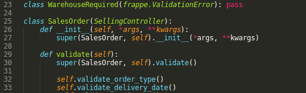
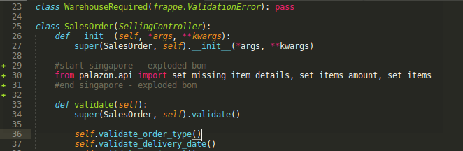
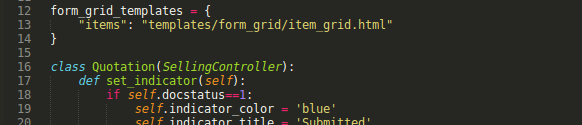
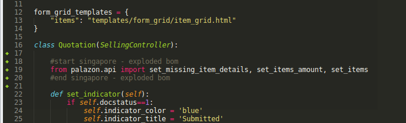

# GreyCube Technologies Ltd.

## App Name - Palazon
**Description** - Get BOM Item Rate based on summation of their individual line item for Sales Order and Quotation. Custom Print format which shows sub bom leaf items.

## How to install app
- [ ] Go to bench directory i.e  /home/ubuntu/frappe-bench
- [ ] ~/frappe-bench$   bench get-app palazon https://github.com/ashish-greycube/palazon
- [ ] ~/frappe-bench$   bench --site site1.local install-app palazon
- [ ] ~/frappe-bench$   bench --site site1.local migrate
- [ ] ~/frappe-bench$   bench clear-cache
- [ ] ~/frappe-bench$   bench restart

#### Edit sales_order.py and quotation.py
Following line is to be added to sales_order.py and quotation.py

```
	#start singapore - exploded bom
	from palazon.api import set_missing_item_details, set_items_amount, set_items
	#end singapore - exploded bom

```
[a] apps/erpnext/selling/doctype/sales_order/sales_order.py

sales_order.py before changes



sales_order.py after changes


```
class SalesOrder(SellingController):
	def __init__(self, *args, **kwargs):
		super(SalesOrder, self).__init__(*args, **kwargs)

	#start singapore - exploded bom
	from palazon.api import set_missing_item_details, set_items_amount, set_items
	#end singapore - exploded bom
	
	def validate(self):
		super(SalesOrder, self).validate()

```
[b] apps/erpnext/erpnext/selling/doctype/quotation.py

quotation.py before changes



quotation.py after changes


```
class Quotation(SellingController):

	#start singapore - exploded bom
	from palazon.api import set_missing_item_details, set_items_amount, set_items
	#end singapore - exploded bom
		
	def set_indicator(self):

```
## For Print Format Customization changes required at below 3 places
1. Terms and Conditions in Quotation and Sales Order
2. LetterHead
3. Sales Taxes and Charges


### Step 1 Create Terms and Conditions for Sales Order
Name : Standard Terms Sales Order
```
PRICE : IN SINGAPORE DOLLARS & SUBJECT TO  0  {{taxes[0].rate}}% GST

DELIVERY TERM : 2 WEEKS

PAYMENT TERM : 30 DAYS
```
### Step 2: Standard Terms Quotation

```
PRICE : IN SINGAPORE DOLLARS & SUBJECT TO  0  {{taxes[0].rate}}% GST
DELIVERY TERM : 2 WEEK
VALIDITY OF QUOTE : 4 WEEKS FROM DATE OF QUOTATION
PAYMENT TERM : 30 DAYS

We look forward to receiving your purchase order soon.

```
### Step 3: Go to Letterhead Add Header and Footer

#### Header
```
<h1>WT WHITS TECHNOLOGIES</h1>
<div><div>Blk 4012 , Ang Mo Kio Ave 10 #05-04A/04, Tech Place 1</div>
<div>Singapore 569628 ( GST <a href="http://Reg.No">Reg.No</a>: 52-929615-B )</div>
<div>Tel :&nbsp; 6458 5707</div>
<div>Fax : 6458 5708</div>
</div>
<div><br></div>
```

#### Footer
```
<div><div>&nbsp;<br></div>


<h5>{{ u.first_name }}&nbsp;{{ u.last_name }}</h5>

<br></div>
```

### Step 4: Go to Sales Taxes and Charges and make Singapore tax as default, it will load by default in new Sales Order /Quotation.

To see the print format in action, go to New Sales Order/Quotation and select respective Term in Terms and Condition field.

Go to Print Section.


## How to do bench update for future
- [ ] ~/frappe-bench/apps/erpnext$ git status
		modified:   erpnext/selling/doctype/sales_order/sales_order.py
		modified:   erpnext/selling/doctype/quotation/quotation.py

- [ ] ~/frappe-bench/apps/erpnext$ git stash

- [ ] Once update, is done i.e. ~/frappe-bench$ bench update
- [ ] Revert the stash changes back ~/frappe-bench/apps/erpnext$ git stash pop

#### License
MIT